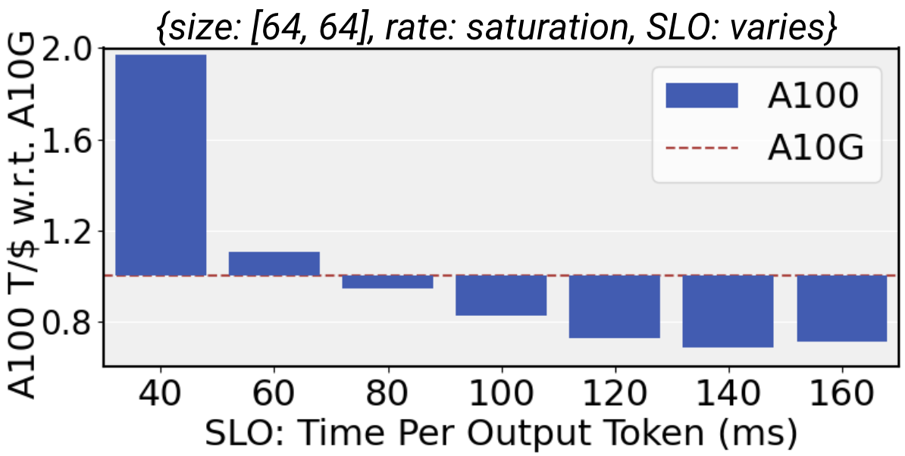

## Overview

### The Challenge of Cost-Efficient GPU Allocation

Large language models (LLMs) are increasingly integrated into many online services, ranging from search engines to virtual assistants. However, the deployment of these models is often cost-prohibitive due to the need for expensive GPU resources. 

<!-- TODO: say something about how people usually only get a single GPU type -->

<!-- We address this challenge by exploiting the heterogeneity of available GPU types to significantly reduce costs without sacrificing performance. -->

Many prior works reduce deployment costs by increasing the inference engine performance, but our study shifts the spotlight to choosing the most cost-effective GPU types for specific LLM services. We discovered that the cost-efficiency of a given GPU is heavily influenced by three key characteristics of LLM services: request sizes, request rates, and service-level objectives (SLOs).

### GPU Heterogeneity: A Solution to Cost Efficiency

Based on our analysis, we introduce **Mélange**, a framework designed to optimize GPU allocation by leveraging the diversity of GPU types. We find that a mix of heterogeneous GPUs, tailored to the specific characteristics of a given LLM service, can lead to significant cost savings. Mélange navigates GPU heterogeneity and formulates GPU allocation as a cost-aware bin-packing problem, efficiently matching service requirements with the most suitable and economical GPU configuration.

*Figure 1: The Mélange Framework*

## Key Factors Influencing GPU Cost Efficiency

### Request Size

The size of each request, which includes both input and output token lengths, significantly impacts GPU cost efficiency. Smaller request sizes tend to be more cost-effective on lower-end GPUs, achieving a higher number of tokens processed per dollar (T/$). Conversely, larger request sizes benefit from the greater processing power of high-end GPUs, making them more cost-efficient for such tasks.

<!-- TODO: drop shadow on the plot -->

  

    
    
Plot 1: Description

  

  

    
    
Plot 2: Description

  

  

    
    
Plot 1: Description

  

  

    
    
Plot 2: Description

  

### Request Rate

At low request rates, services can save costs by scaling down from expensive, high-end GPUs to more affordable, lower-end GPUs. This allows the service to right-size its resources based on demand, optimizing GPU utilization and cost efficiency. Mixing different GPU types further enhances this by providing a finer-grained approach to resource allocation.

  

    
    
Plot 1: Description

  

  

    
    
Plot 2: Description

  

### Service-Level Objectives (SLOs)
Services typically use latency-based service-level objects to define the performance standards that a service must meet. High-end GPUs are essential for stringent SLOs due to their lower latency and higher throughput. However, for services with more relaxed SLOs, lower-end GPUs can be used effectively to cut costs while still meeting performance expectations.

## Mélange

<!-- ### Problem Formulation

Mélange addresses the challenge of allocating GPU resources in a cost-efficient manner for large language model (LLM) services. The framework is designed to minimize the deployment costs while adhering to the service-level objectives (SLOs) for latency and throughput. The problem is characterized by the variability in request sizes and rates, which influence the optimal GPU allocation. -->

<!-- ### ILP Formulation -->

Building on this analysis, we introduce the **Mélange** framework. TODO: add details of the Mélange components here. We solve the GPU allocation problem by formulating it as an integer linear programming (ILP) task. The key components of the ILP formulation are:

- **Request Buckets and Slices:** The workload is divided into buckets based on input and output request sizes. Each bucket is further sliced to facilitate fine-grained allocation.
- **Load Calculation:** For each GPU type, the maximum throughput is determined for given request sizes and SLOs. The load of each slice on a GPU is calculated to ensure it does not exceed the GPU's capacity.
- **Decision Variables:** The ILP uses a matrix to represent whether a slice is assigned to a specific GPU type and a vector to indicate the number of GPUs allocated.
  
The objective function aims to minimize the total cost of GPU allocation while satisfying the SLO requirements for each workload slice.

### End Result

The solution to the ILP provides the minimal-cost GPU allocation that meets the service's demand. Mélange's approach ensures that GPU resources are allocated efficiently, reducing deployment costs significantly while maintaining high service performance. This flexible and heterogeneous-aware framework is effective across diverse GPU types and LLM service characteristics.

## Experimental Results

### Performance Across Different Scenarios

We evaluated Mélange's performance using various GPU types (NVIDIA L4, A10G, A100, and H100) and LLM configurations (Llama2-7b and Llama2-70b). Our results indicate substantial cost reductions in diverse service settings:

- **Short-Context Tasks (Interactive Chats):** Mélange achieved up to 77% cost reduction compared to single-GPU strategies.
- **Long-Context Tasks (Document Summarization):** Cost reductions ranged from 2% to 33%.
- **Mixed-Context Workloads:** Mélange provided cost savings of up to 51%.

*Figure 3: Cost Savings for Different Scenarios*

### Detailed Analysis

Our experiments demonstrated that the most cost-efficient GPU configuration varies based on the size and frequency of requests. For instance, lower-end GPUs like the A10G are more cost-effective for smaller, less frequent requests, whereas high-end GPUs like the A100 are better suited for larger, high-frequency requests.

Moreover, Mélange's flexibility allows it to adapt to changing service demands, ensuring consistent cost efficiency across different operating conditions. For example, during periods of low activity, the framework can dynamically adjust the allocation to cheaper GPUs, maintaining service availability at the lowest possible cost.

  

    
    
Plot 1: Description

  

  

    
    
Plot 2: Description

  

  

    
    
Plot 3: Description

  

  

    
    
Plot 4: Description

  

  

    
    
Plot 5: Description

  

  

    
    
Plot 6: Description

  

*Figure 4: Impact of Request Size on Cost Efficiency*

## Conclusion

Our research introduces a groundbreaking approach to LLM deployment with the Mélange framework. By effectively managing GPU heterogeneity, Mélange offers a scalable and cost-efficient solution for online services relying on large language models. This innovative method not only slashes deployment costs but also ensures that service quality remains uncompromised.

For more detailed insights and access to the full paper, please visit [our research page](#).
