### Overview

* add 2-3 lines of what blog is about, and surprising result

### The High Cost of LLM Deployment

Large language models (LLMs) are increasingly integrated into many online services such as search engines and virtual assistants. However, the deployment of these models is often cost-prohibitive due to the need for expensive GPU resources. 

Many prior works reduce deployment costs by increasing the inference engine performance, but our study shifts the spotlight to choosing the most cost-effective GPU type(s) for any given LLM service.

### GPU Heterogeneity to the Rescue

There is a large and growing option space of AI hardware accelerators, from NVIDIA GPUs and AMD GPUs to Google TPUs, AWS Inferentia, and more. Within these options, higher cost does not always lead to higher performance. We find, instead, that the cost efficiency of a given GPU is heavily influenced by three key characteristics of LLM services: request sizes, request rates, and service-level objectives (SLOs).

Whereas most LLM service deployments use only a single GPU type to host model replicas, we show that a *mix* of heterogeneous GPUs, tailored to the specific characteristics of a given LLM service, can lead to significant cost savings. 

Building on this analysis, we introduce **Mélange**, a framework designed to optimize GPU allocation by leveraging the diversity of GPU types. Mélange navigates GPU heterogeneity and formulates GPU allocation as a cost-aware bin-packing problem, efficiently matching service requirements with the most suitable and economical GPU configuration, which is often a mix of GPU types.

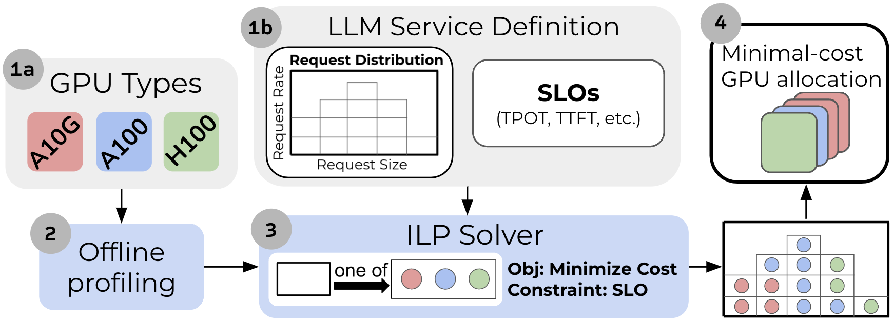
*The Mélange Framework*

## Key Factors Influencing GPU Cost Efficiency

### Request Size

The size of each request, which includes both input and output token lengths, significantly impacts GPU cost efficiency. Smaller request sizes tend to be more cost-effective on lower-end GPUs, achieving a higher number of tokens processed per dollar. Conversely, larger request sizes benefit from the greater processing power of high-end GPUs, making them more cost-efficient for such tasks.

To show how large the cost efficiency can be, we illustrate three case studies. In each case, we measure the maximum throughput each GPU type achieves across a range of request sizes, and divide the throughput by the GPU's on-demand rental cost. In the plots, a tile's shade indicates which GPU is more cost effective and the tile's value indicates the percent increase of cost efficiency relative to the less cost efficient GPU.

* **Llama2-7b on A100 and A10G:** For small requests, A10G achieves up to 72% greater cost efficiency. Conversely, as the request size increases, A100 demonstrates 38% greater cost efficiency.

* **Llama2-70b on L4, A10G, A100, and H100 serving:** We extend the study to include L4 and H100. Plot 3 compres the best GPU to the second best, and Plot 4 compares the best to the worst. Note that, across the large request size spectrum, there are regions where each GPU type is most cost effective.

* **Llama2-70b on 2xH100 and 2xA100:** We also examing a tensor parallel setting, and observe similar trends. The cheaper GPU (A100) achieves higher cost efficiency for smaller requests, while the higher-end GPU (H100) excels for large request sizes.

<!-- TODO: drop shadow on the plot -->

  

    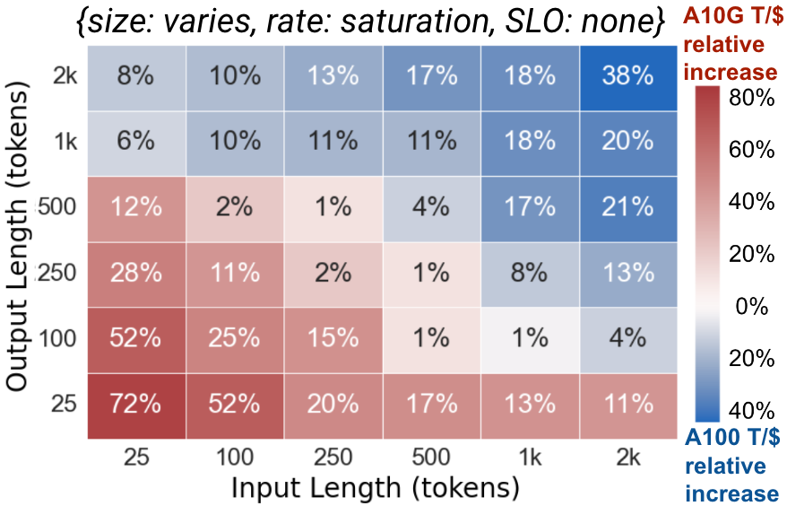
    
Plot 1: Llama2-7b on A10G, A100

  

  

    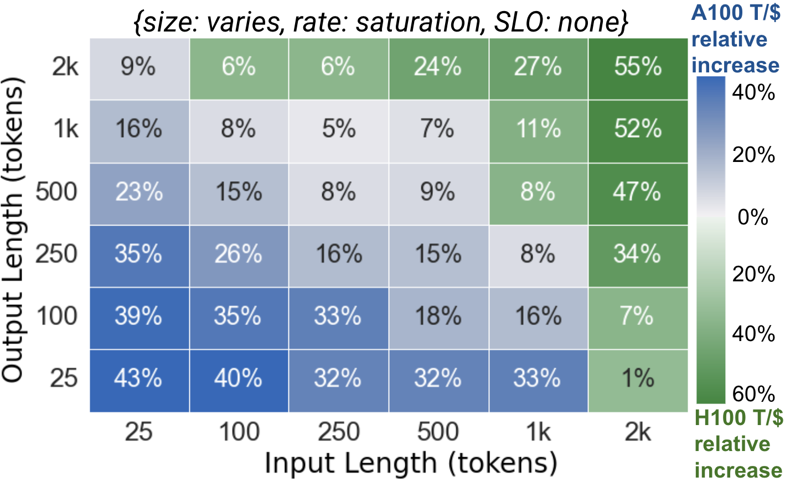
    
Plot 2: Llama2-70b on 2xH100, 2xA100

  

  

    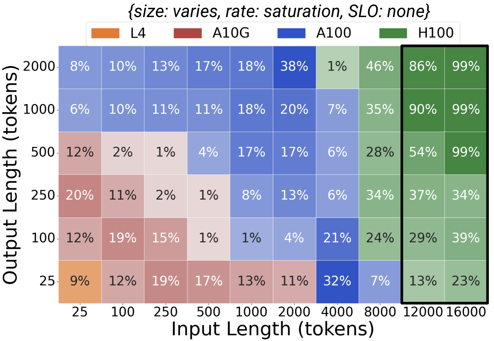
    
Plot 3: Best GPU vs 2nd Best GPU

  

  

    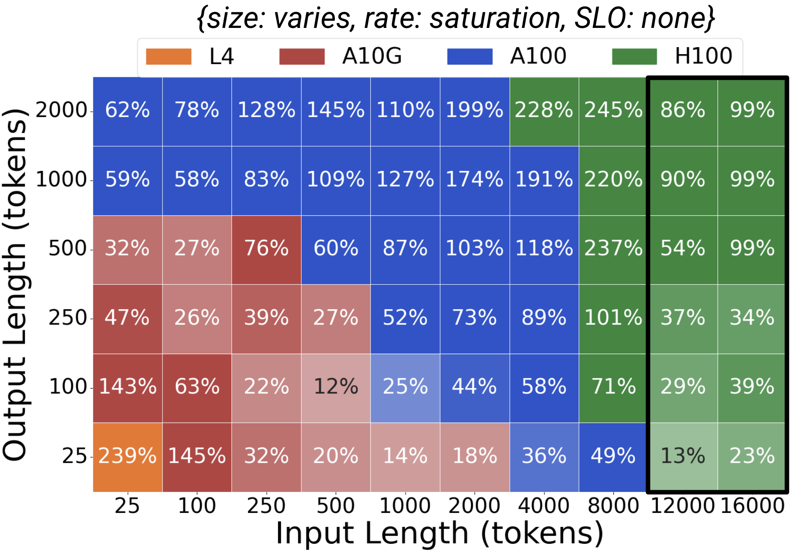
    
Plot 4: Best GPU vs Worst GPU

  

### Request Rate

At low request rates, services can save costs by scaling down from expensive, high-end GPUs to more affordable, lower-end GPUs. This allows the service to right-size its resources based on demand, optimizing GPU utilization and cost efficiency. Mixing different GPU types further enhances cost savings by providing a finer-grained approach to resource allocation, which better aligns provisioned resources with workload demand

Consider serving Llama2-7b with three different GPU allocation policies: A10G-only, A100-only, or a mix of both. Plot 5 depicts the on-demand rental cost of serving a range of traffic volume. At low rates A10G is the cheaper choice, then A100 becomes the economic option for higher rates. However, using a mix of A10G and A100s permits finer-grained scaling and consistently leads to the lowest cost.

  

    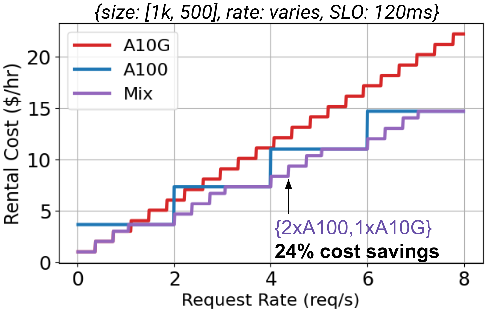
    
Plot 5: Llama2-7b on A10G and A100 across rates

  

  

    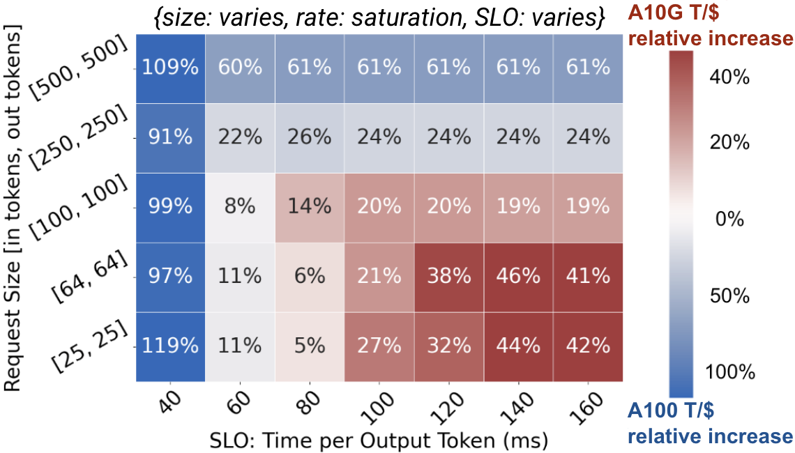
    
Plot 6: Llama2-7b on A10G and A100 across TPOT SLOs and request sizes

  

### Service-Level Objectives (SLOs)
Services typically establish latency-based service-level objects to define the performance standards that a service must meet. High-end GPUs are essential for stringent SLOs due to their lower latency and higher throughput. However, for services with more relaxed SLOs, lower-end GPUs can be used effectively to cut costs while still meeting performance expectations.

In Plot 6, we compare the cost efficiency of A10G and A100 serving Llama2-70b at a range of request rates and time per output token (TPOT) SLOs. A modification to the TPOT SLO shifts the boundary within the request size space between which A10G or A100 are most cost effective, and significantly influences the magnitude of cost efficiency differences between the GPUs. As a result, both request size and SLO must be considered in tandem when determining cost efficiency.

## Mélange

Building on this analysis, we introduce **Mélange**, a GPU allocation framework that dervices the minimal-cost GPU allocation for a given LLM service. 

In Mélange, each GPU type (1a) passes through a one-time offline profiling step (2) to measure GPU performance across request sizes and rates. Then, given the profiling results and an LLM service definition (1b), Mélange’s objective is to choose a GPU allocation for the service workload that minimizes cost. To do so, we frame the allocation task as a cost-aware bin packing problem, where bins are GPUs and items are slices of the workload. We formulate the problem as an integer linear program (ILP) and efficiently solve with an off-the-shelf solver (3). Upon solution, Mélange produces the GPU allocation that can serve the LLM service at minimal cost while adhering to the service SLO (4).

Mélange’s strength stems from two key properties. First, it is heterogeneity-aware. Mélange’s profiling and ILP formulation account for the large diversity of GPU types and LLM services, enabling efficient navigation of heterogeneous GPU types given a service specification. Second, Mélange is flexible. The inputs (1a, 1b) can be flexibly modified to include new generations of GPUs or alternative definitions of SLO, ensuring Mélange is effective for diverse services.

## Experimental Results

We evaluated Mélange's performance using various GPU types (NVIDIA L4, A10G, A100, and H100), model sizes (Llama2-7b and Llama2-70b), and workloads (short-context, long-context, mixed-context). We compare to baselines that use only a single GPU type. Our results indicate substantial cost reductions in diverse service settings:

- **Short-Context Tasks (Interactive Chats):** Mélange achieved 15-77% cost reduction compared to single-GPU strategies.
- **Long-Context Tasks (Document Summarization):** Cost reductions ranged from 2-33%.
- **Mixed-Context Workloads:** Mélange provided cost savings of up to 13-51%.

### Detailed Analysis

Our experiments demonstrated that the most cost-efficient GPU configuration varies based on the size and frequency of requests. For instance, lower-end GPUs like the A10G are more cost-effective for smaller, less frequent requests, whereas high-end GPUs like the A100 are better suited for larger, high-frequency requests.

Moreover, Mélange's flexibility allows it to adapt to changing service demands, ensuring consistent cost efficiency across different operating conditions. For example, during periods of low activity, the framework can dynamically adjust the allocation to cheaper GPUs, maintaining service availability at the lowest possible cost.

  

    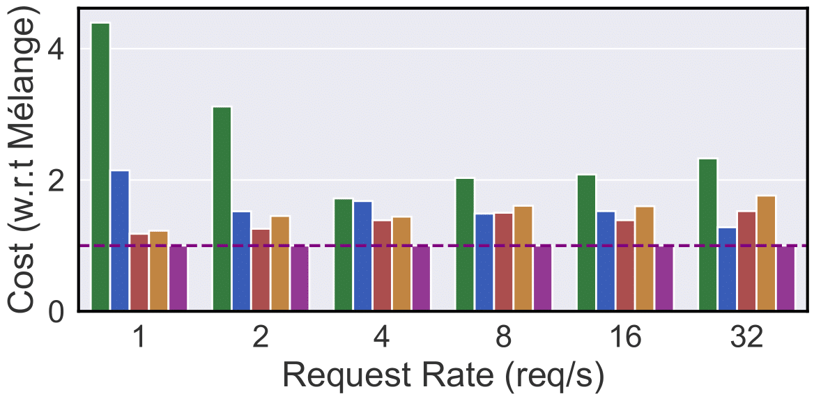
    
Short-context, 120ms TPOT SLO

  

  

    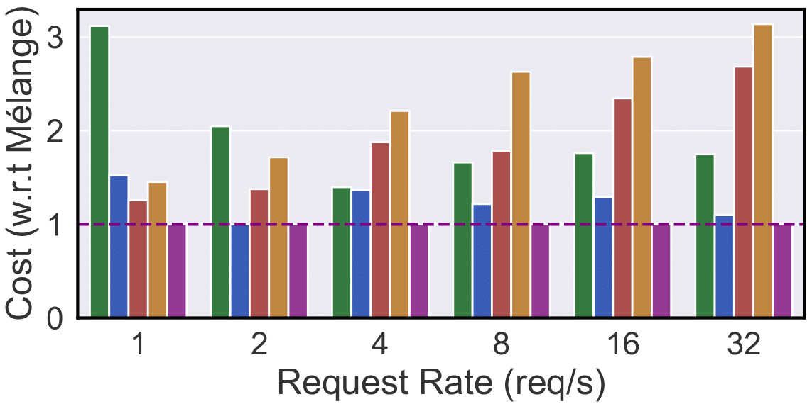
    
Short-context, 40ms TPOT SLO

  

  

    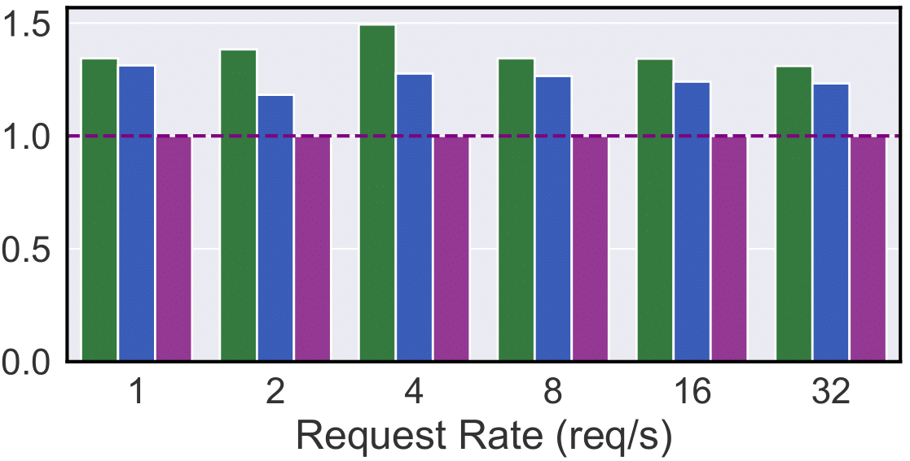
    
Long-context, 120ms TPOT SLO

  

  

    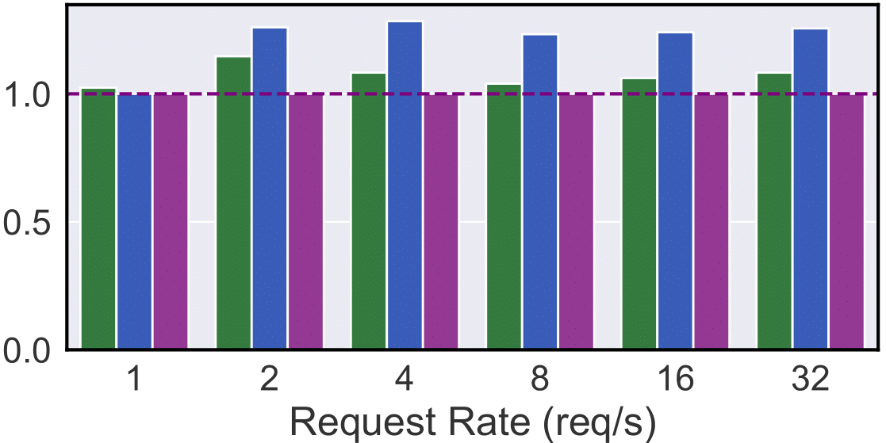
    
Long-context, 40ms TPOT SLO

  

  

    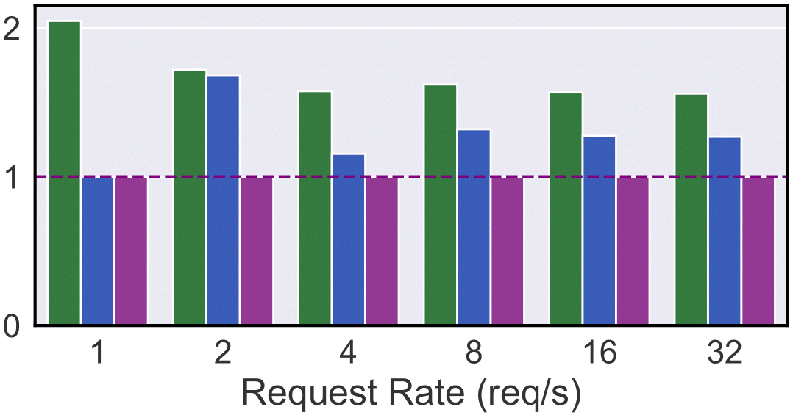
    
Mixed-context, 120ms TPOT SLO

  

  

    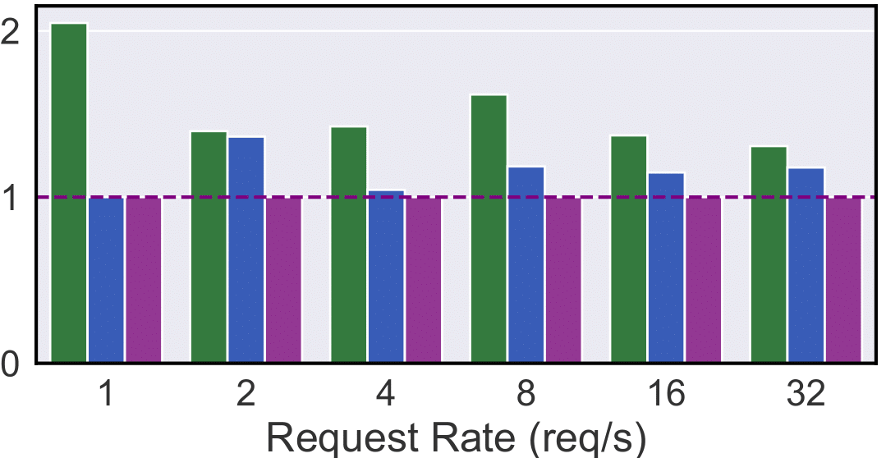
    
Mixed-context, 40ms TPOT SLO

  

## Conclusion

Our research introduces a groundbreaking approach to LLM deployment with the Mélange framework. By effectively managing GPU heterogeneity, Mélange offers a scalable and cost-efficient solution for online services relying on large language models. This innovative method not only slashes deployment costs but also ensures that service quality remains uncompromised.

For more detailed insights and access to the full paper, please visit [our research page](#).
